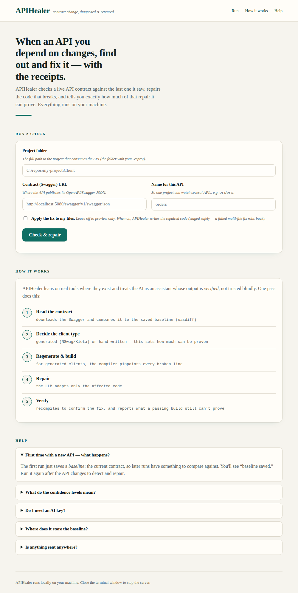
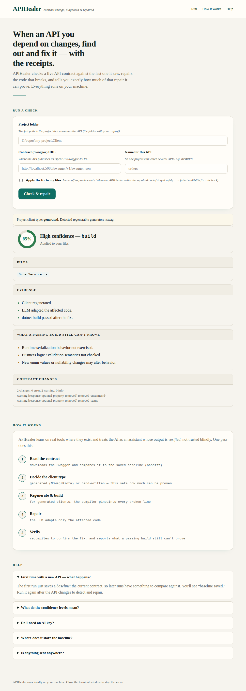

# APIHealer

**A verification-aware API contract remediation tool.**

> **APIHealer doesn't automate trust. It automates remediation and makes trust
> measurable.**

When an API you consume changes, APIHealer detects the breaking change, proposes or applies a consumer-side remediation,
and — the part that makes it different — reports *with what level of evidence*
that remediation can be trusted. It doesn't just sell
"AI fixed it"; it tells you how much it can actually prove.

> Python orchestrates; native tools do the work; the compiler verifies; the LLM
> only proposes.

---

## Overview

The repository is intentionally split into three parts:

| Folder | What it is |
|---|---|
| [`apihealer/`](./apihealer) | The tool. Runs as a local **web UI** (easy, hands-on) or a **CLI** (automation / CI). |
| [`testbench/`](./testbench) | A runnable demo: small .NET projects that exercise both the generated and manual paths. |
| [`docs/`](./docs) | Deep dives: [Verification](./docs/Verification.md), [Architecture](./docs/Architecture.md), [How it works](./docs/How-it-works.md), [CI/CD](./docs/CI-CD.md). |

## Example

A provider reshapes `GET /orders/{id}` — `customerId`/`status` become a nested
`customer.id` and a renamed `state`. For a generated client, APIHealer
regenerates, the compiler flags the broken lines, and the fix comes back
verified:

```csharp
// before
var customerId = order.CustomerId;
var status     = order.Status;

// after (APIHealer)
var customerId = order.Customer?.Id;   // nested now — note the null-safe access
var status     = order.State;          // renamed
```

Note the `?.` — the fix accounts for the newly nested object being null, not
just the rename. Then it recompiles to confirm, and reports **build**-level
verification at high confidence, with the residual risks still listed.

## Quick start

```bash
cd apihealer
pip install -e .

# local, hands-on (opens in your browser):
python -m apihealer.web

# automation / CI:
apihealer --path . --name orders --swagger-url <url> --apply --report md
```

The web UI is the friendliest way to try it. The CLI is what you wire into a
pipeline. Same engine underneath. Full commands in
[apihealer/README.md](./apihealer/README.md); a guided demo in
[testbench/README.md](./testbench/README.md).



## Verification

Not every fix earns the same confidence. The client type decides the strategy,
the evidence behind the result, and what can still be wrong afterward:

| Client type | Verification | Confidence | What can still be wrong |
|---|---|---|---|
| Generated (NSwag/Kiota) | Compiler verified | High | Runtime / business behavior |
| Manual (hand-written) | Build/syntax only | Medium / Low | Contract semantics — may compile and still be wrong |
| None / Unknown | Human review | n/a | Everything — nothing was changed |

Every run produces a structured `VerificationReport` (evidence + confidence +
residual risks). The full model is in [docs/Verification.md](./docs/Verification.md).



## Architecture

Two halves with a clean boundary: a language-agnostic **core** (contract diff,
orchestration) and pluggable **adapters** (the .NET adapter is a thin
coordinator over a classifier, two fix strategies, and a toolchain). Two axes
grow without touching the core: language adapters and contract sources. Details
in [docs/Architecture.md](./docs/Architecture.md).

## Roadmap

- CI/CD adoption in three levels ([docs](./docs/CI-CD.md)): run in any pipeline,
  publish the report, and prepare a PR from the fix — all working today. Next: a
  host adapter that opens the PR end to end.
- More language adapters.
- Additional contract sources, and a three-tier manual path (safe-patch /
  inferred / human-checkpoint).

## Requirements

- Python 3.10+
- [oasdiff](https://github.com/oasdiff/oasdiff) on PATH
- For the .NET path: the `dotnet` SDK, and `nswag` for generated clients
- Optional LLM: `ANTHROPIC_API_KEY` for Claude, or a local Ollama

## Status

MVP. Working end to end for the generated path, with an honest lower-confidence
path for manual clients. Validated on a real .NET project; per-API baselines are
committed so it works the same locally and in CI.
